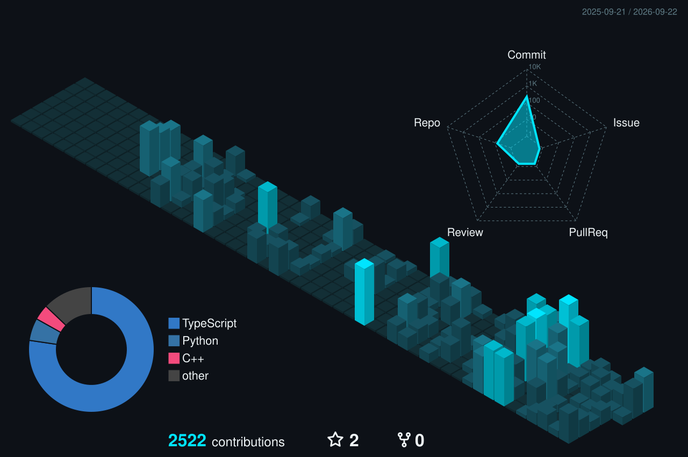

<p>
I build browser engines, native Windows tools, multiplayer platforms, and web apps. Most projects start because something I use every day is missing a feature or handles an edge case badly.
</p>

<p>
<a href="https://adityasharma0101.vercel.app">Portfolio</a> ·
<a href="https://linkedin.com/in/aditya-sharma-62a55b348">LinkedIn</a>
</p>


<table width="100%">
<tr><td valign="top">
<b>EndoFrame</b> · A non-Chromium browser engine written from scratch in Rust. ECS-based DOM for cache-coherent parallelism, a wgpu GPU rendering pipeline, QuickJS scripting, and its own HTML tokenizer, CSS cascade, and layout engine across nine crates.
<br><sub>Rust · wgpu · QuickJS &nbsp;|&nbsp; <a href="https://github.com/Adityasharma0101911/EndoFrame">Repo</a></sub>
</td></tr>
<tr><td valign="top">
<b>SomeGame</b> · A multiplayer party-game platform at somegame.party. NestJS REST API, Colyseus server-authoritative realtime, Prisma on PostgreSQL, Redis presence, rotating refresh sessions with CSRF, and a five-service production stack behind a Cloudflare Tunnel with verified rollback.
<br><sub>NestJS · Colyseus · Prisma · PostgreSQL · Redis · Next.js &nbsp;|&nbsp; <a href="https://somegame.party">Live</a> · <a href="https://github.com/Adityasharma0101911/somegame-frontend">Frontend</a> · <a href="https://github.com/Adityasharma0101911/somegame-backend">Backend</a></sub>
</td></tr>
<tr><td valign="top">
<b>Portfolio</b> · A scroll-driven 3D portfolio. A cinematic camera flies a spline through 13+ WebGL scenes with live screenshot textures, animated GLB bird flocks, and a PS1-style post-processing pass. Data-driven: drop a JSON file in the content folder and the 3D scene extends itself.
<br><sub>Next.js 16 · React Three Fiber · TypeScript · Tailwind 4 &nbsp;|&nbsp; <a href="https://adityasharma0101.vercel.app">Live</a> · <a href="https://github.com/Adityasharma0101911/Portfolio">Repo</a></sub>
</td></tr>
<tr><td valign="top">
<b>Clinica</b> · A healthcare platform with live medical transcription over a Deepgram WebSocket and AI visit summaries, action items, and red-flag alerts. Winner, IBM Z × UNSA Sheridan Hackathon 2026.
<br><sub>Next.js 15 · React 19 · IBM Cloudant · IBM watsonx · Deepgram &nbsp;|&nbsp; <a href="https://clinica-io.vercel.app">Live</a></sub>
</td></tr>
</table>


<table width="100%">
<tr>
<td width="50%" valign="top">
<b>FluxFrames</b> · A video frame-interpolation studio for Windows. C# WinForms hosting a WebView2 UI, an ffmpeg extract-interpolate-encode pipeline driving RIFE, DAIN, FLAVR, and IFRNet engines, and a Windows Job Object so no worker tree ever outlives the app.
<br><sub>C# · WinForms · WebView2 · ffmpeg · VapourSynth</sub>
</td>
<td width="50%" valign="top">
<b>Code to Music</b> · A visual and code music workstation. 16-step sequencer, arrangement, mixer, a clean-room pattern language that never evaluates JavaScript, deterministic WAV and MIDI exports, and a sandboxed Electron shell.
<br><sub>TypeScript · Web Audio · Electron</sub>
</td>
</tr>
<tr>
<td width="50%" valign="top">
<b>DockWave</b> · macOS-style dock magnification for the Windows 11 taskbar. Hooks the taskbar through PDB symbols, drives animation off XAML's render loop, per-monitor state isolation, frame-rate-independent smoothing.
<br><sub>C++ · Windhawk · WinRT/XAML</sub>
</td>
<td width="50%" valign="top">
<b>Shake to find cursor</b> · macOS cursor magnification for Windows. Low-level mouse hook, ring-buffer shake detection, layered-window overlay rendering in ~700 lines.
<br><sub>C++ · Win32 · GDI+</sub>
</td>
</tr>
<tr>
<td width="50%" valign="top">
<b>Portable Shazam</b> · Identifies whatever is playing on the system through WASAPI loopback capture. No microphone, no API key. Shipped as a standalone executable.
<br><sub>Python · CustomTkinter · ShazamIO &nbsp;|&nbsp; <a href="https://github.com/Adityasharma0101911/Portable-Shazam">Repo</a></sub>
</td>
<td width="50%" valign="top">
</td>
</tr>
</table>


<table width="100%">
<tr>
<td width="50%" valign="top">
<b>Spotisync</b> · Live music profile pages. Spotify OAuth with AES-GCM token encryption, SSE-pushed now-playing updates, word-synced lyrics with layered fallbacks, and album-art palette extraction.
<br><sub>Next.js · Supabase · Upstash Redis &nbsp;|&nbsp; <a href="https://spotisync.vercel.app">Live</a></sub>
</td>
<td width="50%" valign="top">
<b>Webpage Downloader</b> · A Chrome and Edge extension that saves a site as one self-contained offline HTML file. Renders internal pages in background windows, replays recorded fetch responses, re-opens captured menus, and blocks all network access inside the archive.
<br><sub>Chrome MV3 · JavaScript</sub>
</td>
</tr>
<tr>
<td width="50%" valign="top">
<b>Next Transit</b> · Real-time TTC tracker with live subway, bus, and streetcar positions, route search, and arrival countdowns.
<br><sub>Next.js · TypeScript · Python · TTC Open Data</sub>
</td>
<td width="50%" valign="top">
<b>LofiLoop</b> · Browser beat maker. 16-step sequencer, subtractive synth with ADSR envelopes, Euclidean rhythms, MIDI export.
<br><sub>Next.js 15 · Web Audio API &nbsp;|&nbsp; <a href="https://lofi-loop.vercel.app">Live</a></sub>
</td>
</tr>
<tr>
<td width="50%" valign="top">
<b>Zenith</b> · Student wellness platform unifying finances, academics, and health. Built in 24 hours as team lead at TMU Tech Week.
<br><sub>Next.js 14 · Flask · GSAP &nbsp;|&nbsp; <a href="https://myzenith.vercel.app">Live</a></sub>
</td>
<td width="50%" valign="top">
</td>
</tr>
</table>


<table width="100%">
<tr>
<td width="50%" valign="top">
<b>Roblox / Luau systems</b> · Server-side water simulation with 10 wave presets and rigid-body floating, a PS1-aesthetic camera and VFX system, respawn and sprint modules. Written under strict mode with performance as a design constraint.
<br><sub>Luau · Roblox Studio</sub>
</td>
<td width="50%" valign="top">
<b>Unravel</b> · A timed arcade game where the cursor acts as a black hole pulling star particles inward.
<br><sub>Java · Swing 2D</sub>
</td>
</tr>
</table>


```
Python · TypeScript · Rust · C# · Java · C++ · Lua/Luau
Next.js · React · R3F · NestJS · Colyseus · Prisma · Tailwind
Tauri · Electron · Qt · Windhawk · Win32 · WebView2 · wgpu
PostgreSQL · Redis · Supabase · SQLite · Docker · Vercel
```

<a href="https://adityasharma0101911.github.io/Adityasharma0101911/">
<picture>
  <source media="(prefers-color-scheme: dark)" srcset="./profile-3d-contrib/night.svg">
  <source media="(prefers-color-scheme: light)" srcset="./profile-3d-contrib/day.svg">
  
</picture>
</a>
<p align="center"><sub>click the calendar for the <a href="https://adityasharma0101911.github.io/Adityasharma0101911/">interactive 3D version</a> — hover any tower for its exact count</sub></p>
